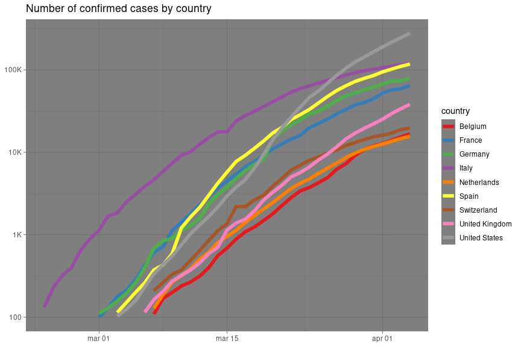
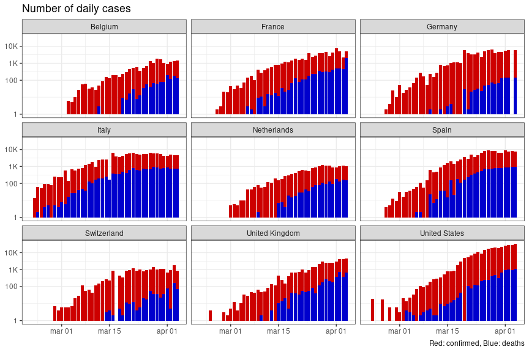
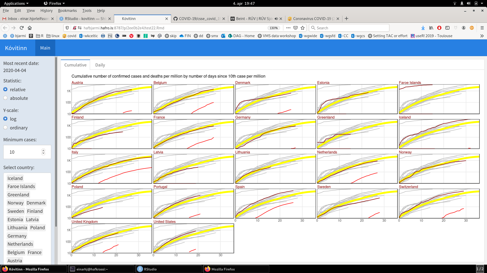

Easing access and exploration of COVID-19 data

## Installing


```r
remotes::install_github("einarhjorleifsson/kovitinn")
```

## Get data


```r
library(tidyverse)
library(kovitinn)

d <- get_covid("ecdc")
```

or try:

```r
d2 <- get_covid("jhu")
d3 <- get_covid("us")
```


## Quick plots


```r
d %>% 
  filter(country %in% c("Italy", "Spain", "France", "Germany",
                        "United States", "United Kingdom",
                        "Belgium", "Switzerland", "Netherlands"),
         type == "confirmed",
         cn >= 100) %>% 
  ggplot(aes(date, cn, colour = country)) +
  theme_dark() +
  geom_line(lwd = 2) +
  scale_y_log10(breaks = c(100, 1000, 10000, 100000),
                labels = c("100", "1K", "10K", "100K")) +
  scale_colour_brewer(palette = "Set1") +
  labs(title = "Number of confirmed cases by country",
       x = NULL,
       y = NULL)
```

<!-- -->


```r
d %>% 
  filter(country %in% c("Italy", "Spain", "France", "Germany",
                        "United States", "United Kingdom",
                        "Belgium", "Switzerland", "Netherlands"),
         n > 0,
         date >= lubridate::ymd("2020-02-20")) %>%
  spread(type, n, fill = 0) %>% 
  ggplot() +
  theme_bw() +
  geom_col(aes(date, confirmed), fill = "red3") +
  geom_col(aes(date, deaths), fill = "blue3") +
  facet_wrap(~ country) +
  scale_y_log10(breaks = c(1, 1e2, 1e3, 1e4, 1e5, 1e6),
                labels = c("1", "100", "1K", "10K", "100K", "1M")) +
  scale_fill_brewer(palette = "Set1") +
  labs(title = "Number of daily cases",
       x = NULL,
       y = NULL,
       caption = "Red: confirmed, Blue: deaths")
```

<!-- -->

## Flexdashboard

Go: File -> New file -> R Markdown ... -> From template -> covid dashboard

Run the stuff and get something like:



